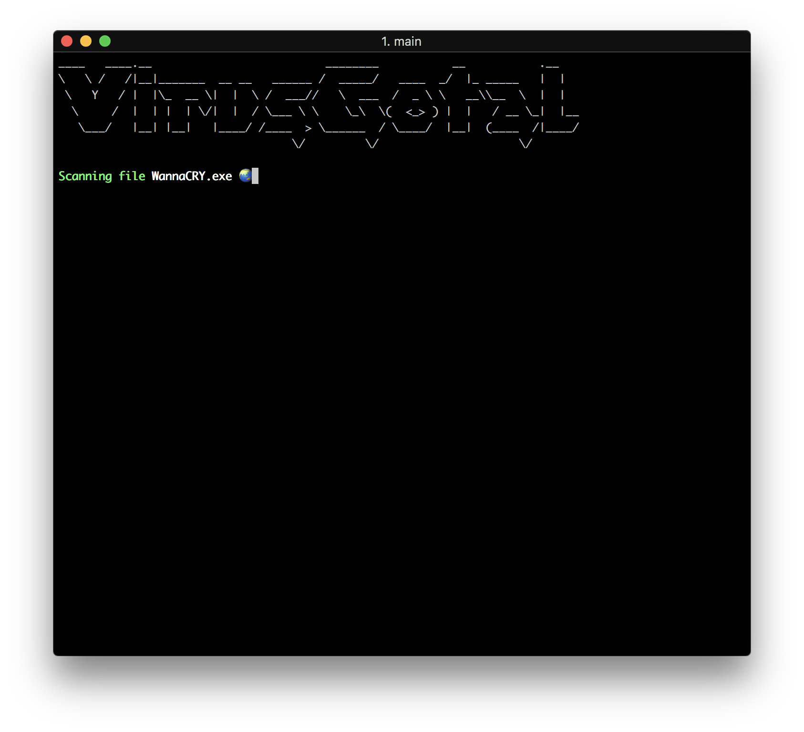
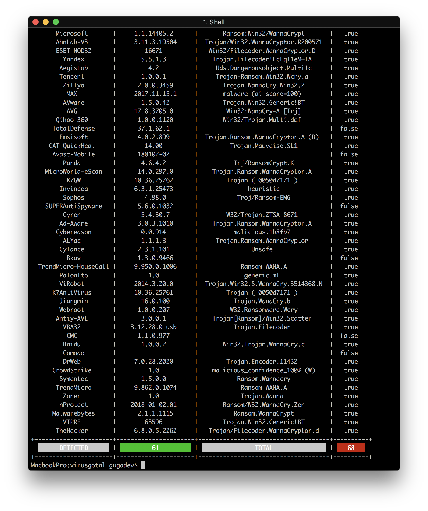

<h1 align="center">VirusGotal</h1>

<p align="center">
  
  
</p>

Tiny CLI app to upload a file to VirusTotal and show the report.

---

### Requirements

You need to create an account at [VirusTotal Community](https://www.virustotal.com/es/community/) to get your API key.

### Build

Just run the following command to generate a binary file for your system:

```go
go build main.go
```

### Usage

You just need to provide two arguments:

- `file`: the absolute path of the file to scan.
- `key`: your VirusTotal API key.

**Example**

```go
virusgotal -file=/path/to/file.ext -key=<your virustotal api key>
```
